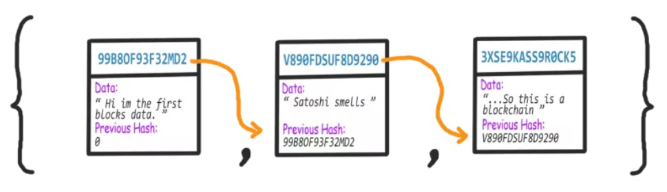

# 区块链

这是一个用于学习目的的简单的 Java 区块链。

区块链具有下列基本特性：

* 区块链是由存储数据的一个个区块组成的。
* 每一个区块都有自己的数字签名，以及前一个区块的数字签名，这样就把所有的区块串连起来了。
* 对于新加入的区块，需要执行一系列的挖矿验证性工作去检查其合法性。
* 可以检查区块数据是否合法和是否被篡改。

## 区块链简述

一个区块链只是一个个区块的链接/列表。区块链中的每一个区块都会有自己的数字签名，前一个区块的数字签名和一些数据（例如一些交易数据）。

每一个区块不仅仅包含前一个区块的 hash 值，其自己的 hash 值，有一部分是根据前一个区块的 hash 值计算出来的。如果前一个区块的数据发生了变化，那么前一个区块的 hash 值也会随之变化（因为它有一部分是根据区块的数据进行计算的），并会依次影响所有区块的 hash 值。通过计算和比较 hash 值，我们可以判断区块链是否合法。

## 为区块生成数字签名
	
我们需要一种方法去生成数字签名，有很多加密算法可供我们选择，当然 SHA256 算法正好适合我们这个例子。我们可以通过 `java.security.MessageDigest` 来使用 SHA256 算法。
	
我们必须根据区块中那些不想被篡改的数据来计算 hash 值。对于本例中的区块，我们会包含前一个区块的 hash 值、数据，以及时间戳。

## 挖矿

为了创建一个新的区块，矿工必须找到满足特定要求的 hash 值。这也就是挖矿验证性工作。

在本例中，只有当为区块生成的 hash 值以指定数量的 0 开头，才能将其添加到区块链中。

## 检查区块链的合法性

简单的说，就是遍历链中所有的区块并比较其 hash 值。这里需要能够检查当前区块的 hash 值和计算出来的 hash 是否相等，以及前一个区块的 hash 值是否等于当前区块存储的前一个 hash 值。

在比特币网络中，区块链被每个节点所共享，最长的合法链会被接受。那么靠什么去阻止某人篡改旧区块中的数据，然后创建一个全新的更长的区块链并将其分享到网络中？答案是区块链合法性验证的工作量。 hashcash 的验证工作意味着计算机需要大量的时间和计算能力来创建新的区块。因此，攻击者需要比其他同行拥有更多的计算能力。

## 参考

* [用 Java 创造你的第一个区块链，第一部分](https://juejin.im/post/5a8ed1d75188257a836c4218) ([NeoyeElf](https://github.com/NeoyeElf) 翻译)
* [用 Java 创造你的第一个区块链之第二部分 — 交易](https://juejin.im/post/5a940b116fb9a0633757587a) ([IllllllIIl](https://github.com/IllllllIIl) 翻译)